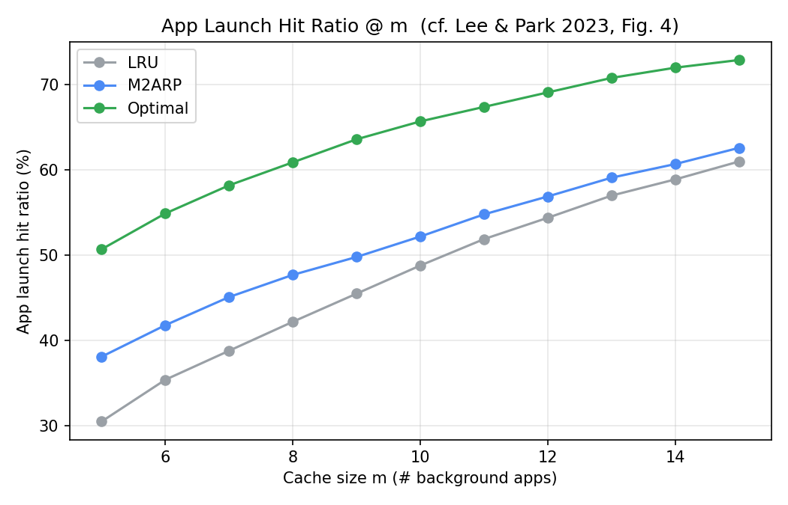
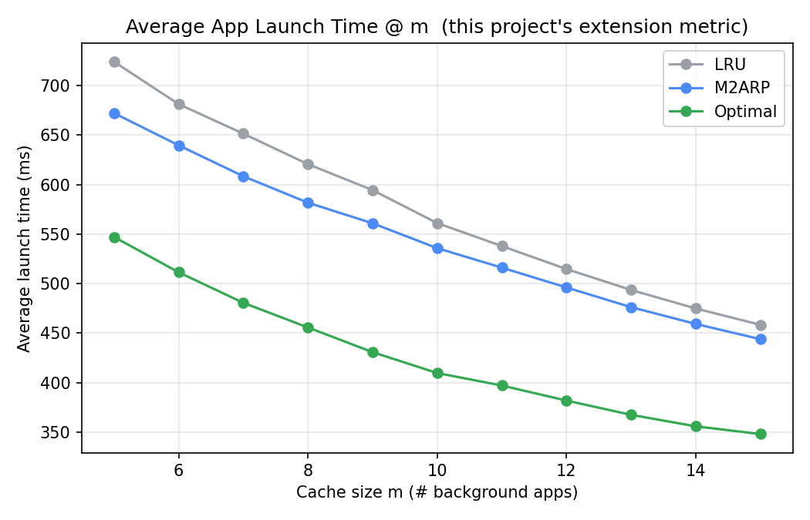
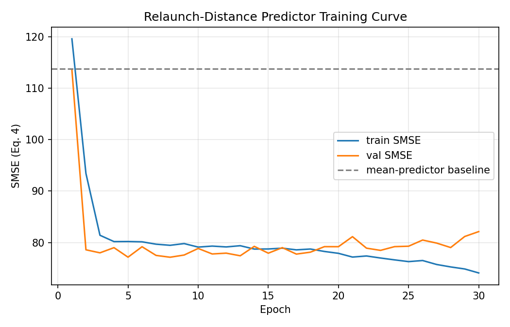

# M2ARP 재구현 프로젝트 — 재실행 거리 예측 기반 모바일 메모리 관리

> 비공식 개인 재구현(reproduction) 프로젝트입니다. 중앙대학교 대학원 지원을 준비하며,
> 관심 있는 연구실의 논문을 직접 읽고 알고리즘을 구현·검증해보기 위해 만들었습니다.
> 논문 저자/연구실과는 무관한 개인 학습용 프로젝트이며, 공식 구현체가 아닙니다.

원 논문:

> Jaehwan Lee and Sangoh Park, "An Efficient Memory Management for Mobile
> Operating Systems Based on Prediction of Relaunch Distance,"
> *Computer Systems Science and Engineering*, vol. 47, no. 1, pp. 171–186, 2023.
> DOI: [10.32604/csse.2023.038139](https://doi.org/10.32604/csse.2023.038139)
> (CC BY 4.0)

---

## 1. 이 프로젝트가 하는 일

모바일 OS(Android 등)는 앱을 전환할 때 프로세스를 즉시 종료하지 않고 백그라운드에
캐싱해두었다가, 메모리가 부족해지면 그중 일부를 종료(kill)합니다. 대부분의 OS는
LRU(Least Recently Used) — 가장 오랫동안 안 쓴 앱부터 종료 — 를 쓰는데, 문제는
"오랫동안 안 썼다"가 "곧 다시 쓸 것이다"와 무관할 수 있다는 점입니다. 자주 쓰는
앱이라도 잠깐 안 썼다는 이유로 먼저 종료되면, 다음에 그 앱을 열 때 콜드 스타트가
발생해 체감 성능이 떨어집니다.

원 논문은 이 문제를, "각 앱이 다음에 다시 실행되기까지 몇 개의 다른 앱이
실행될 것인가" 를 뜻하는 재실행 거리(relaunch distance) 라는 지표로
정의하고, 이를 LSTM으로 예측해 가장 늦게 재사용될 것으로 예측되는 앱을
먼저 종료하는 메모리 관리 기법 M2ARP를 제안합니다. 예측이 힘든(사용
이력이 적은) 앱에 대해서는 자동으로 기존 LRU와 동일하게 동작하는
LRU 폴백(fallback) 메커니즘도 포함되어 있습니다.

이 저장소는 위 알고리즘(Algorithm 1, SMSE 손실 함수, LRU 폴백)을 NumPy만으로
(딥러닝 프레임워크 없이) 처음부터 구현하고, 합성(synthetic) 앱 사용
트레이스로 논문 4.4절과 동일한 방법론(캐시 크기별 hit ratio 벤치마크)을
재현한 것입니다.

---

## 2. 원 논문 핵심 개념 요약 (제 이해로 정리)

- 재실행 거리 d(lₜ): 시점 t에 앱 lₜ가 실행된 후, 그 앱이 다시 실행되는
  시점까지 사이에 실행된 서로 다른*앱의 개수. 다시는 실행되지 않으면 유효하지
  않음(censored)으로 표시한다. (원 논문 Eq. 1–2)
- Algorithm 1 (onAppLaunch): 앱이 실행될 때마다
  1. 그 앱이 예측 가능한 집합(A\*)에 속하면 LSTM으로 재실행 거리를 예측하고,
     그렇지 않으면(신규 설치, 사용 이력 부족) 0으로 둔다.
  2. 캐시에 있는 다른 모든 앱의 재실행 거리 카운터를 1씩 감소시킨다.
  3. 메모리가 부족하면, 캐시된 앱 중 재실행 거리의 절댓값이 가장 큰 앱을
     종료한다.

  이 절댓값 규칙이 핵심적으로 영리한 부분인데, 예측이 전부 0으로 시작하면
  이 메커니즘은 시간이 지날수록 점점 더 음수로 커지는(= 오래 안 쓴) 앱을
  종료하는 것과 같아져서 정확히 기존 LRU와 동일하게 동작합니다.
  (본 저장소 `tests/test_correctness.py`에서 이 성질을 실제로 검증합니다.)
- **SMSE(Selective MSE) 손실**: 재실행 기록이 없는(censored) 샘플은 손실 계산에서
  제외하여, 그런 샘플이 학습을 왜곡하지 않도록 한다. (Eq. 4)
- LRU 폴백: 학습 데이터가 부족한 앱은 예측값을 0으로 고정해, 예측이
  불확실할 때는 안전하게 기존 LRU 수준으로 동작하도록 설계.

---

## 3. 이 프로젝트에서 실제로 구현한 것

| 구성 요소 | 파일 | 설명 |
|---|---|---|
| 합성 앱 사용 트레이스 생성기 | `src/trace_generator.py` | Zipf 인기도 분포 + 시간대별 반복 루틴 템플릿을 혼합해, 실제 사용자 습관과 유사한 학습 가능한 패턴을 만듦 |
| 재실행 거리 계산 | `src/relaunch.py` | 논문 Eq. 1–2 / Algorithm 2 그대로 구현 |
| 슬라이딩 윈도우 데이터셋 | `src/dataset.py` | 과거 N개 앱 이력 → 재실행 거리 회귀 타겟 |
| NumPy 전용 LSTM (순전파+BPTT 직접 구현) | `src/lstm_numpy.py` | 프레임워크 없이 forget/input/output/candidate 게이트, Adam 옵티마이저, SMSE 손실을 직접 구현. 수치미분 대비 gradient check로 정확성 검증 |
| Algorithm 1 캐시 시뮬레이션 엔진 | `src/policies.py` | LRU / Optimal(오라클) / M2ARP를 "재실행 거리를 어떻게 정하는가"만 다른, 동일한 하나의 엔진으로 구현 (논문의 설계 의도를 그대로 반영) |
| 전체 실험 파이프라인 | `src/run_experiment.py` | 학습 → 캐시 크기별(m=5..15) 시뮬레이션 → 표/그래프 저장 |
| 정확성 검증 테스트 | `tests/test_correctness.py` | (1) BPTT gradient check (2) "예측 전부 0 = LRU" 동치성 검증 |

---

## 4. 원 논문과의 차이점 (반드시 밝혀야 할 한계)

원 논문은 실제 기기(Google Pixel 3)에서 Tsinghua 대학의 실사용자 앱 사용
로그(단일 사용자, 93개 앱, 2,601건)를 사용해 TensorFlow/Keras 기반 LSTM
(2층, 128 유닛, dropout 0.2, 하이퍼파라미터 탐색 포함)으로 벤치마크했습니다.
저는 이 데이터셋에 접근할 수 없었고, 개발 환경에 딥러닝 프레임워크(PyTorch/
TensorFlow)도 설치할 수 없었기 때문에, 아래와 같이 대체했습니다.

| 항목 | 원 논문 | 이 프로젝트 |
|---|---|---|
| 데이터셋 | Tsinghua 실사용자 로그 (1명, 93개 앱, 2,601건) | 합성 생성 트레이스 (40개 앱, 약 11,000건) |
| 모델 구현 | TensorFlow/Keras, 2층 LSTM, 128 유닛, dropout 0.2 | **NumPy로 직접 구현한 1층 LSTM**, 32 유닛 (프레임워크 미사용) |
| 입력 인코딩 | 앱 ID의 원-핫 벡터 (Eq. 5) | 학습 가능한 임베딩 벡터 (기능적으로 유사, 차원 축소) |
| 벤치마크 종류 | 실기기 측정(4.3절) + 시뮬레이션(4.4절) | 시뮬레이션만 (4.4절 방법론 재현) |
| 실행시간 지표 | 실기기에서 직접 측정 | 앱별 임의 cold/warm 비용을 부여한 근사 지표 |

즉, 알고리즘(Algorithm 1, SMSE, LRU 폴백)과 평가 방법론(hit ratio@m)은
논문 그대로 재현했지만, 데이터와 모델 규모는 실행 가능한 범위로
축소·대체했습니다. 아래 결과의 절대적인 수치(%)는 논문 Table 6과
직접 비교할 수 없고, LRU < M2ARP < Optimal이라는 순서와, 캐시가
작을수록 격차가 벌어지는 경향성이 재현되는지를 확인하는 데 의의가
있습니다.

---

## 5. 결과

### 5.1 Hit ratio @ m (원 논문 Table 6 / Fig. 4 형식)

캐시 크기 m(백그라운드에 유지 가능한 앱 수)을 5~15로 바꿔가며 측정한
캐시 적중률입니다.

| m | LRU | M2ARP | Optimal |
|---|---|---|---|
| 5  | 30.5% | 38.1% | 50.7% |
| 6  | 35.4% | 41.8% | 54.9% |
| 7  | 38.8% | 45.1% | 58.2% |
| 8  | 42.2% | 47.7% | 60.9% |
| 9  | 45.5% | 49.8% | 63.6% |
| 10 | 48.8% | 52.2% | 65.7% |
| 11 | 51.9% | 54.8% | 67.4% |
| 12 | 54.4% | 56.9% | 69.1% |
| 13 | 57.0% | 59.1% | 70.8% |
| 14 | 58.9% | 60.7% | 72.0% |
| 15 | 61.0% | 62.6% | 72.9% |



원 논문의 주장과 같은 경향이 재현되었습니다.

- 모든 캐시 크기 m에서 LRU < M2ARP < Optimal 순서가 유지됩니다.
- m이 작을수록(메모리 제약이 심할수록) LRU와 M2ARP의 격차가 더 큽니다.
  (m=5에서 7.6%p 차이 → m=15에서 1.6%p 차이로 감소) — 논문이 4.4절에서
  언급한 "메모리 제약이 클수록 재실행 거리 예측의 효과가 커진다"는
  관찰과 일치합니다.

### 5.2 평균 실행시간 @ m (이 프로젝트의 확장 지표)

앱별로 서로 다른 cold-start/warm-start 비용을 부여해, hit ratio 개선이
실제 체감 실행시간 개선으로 이어지는지 함께 살펴본 것입니다. (원 논문
4.4절 시뮬레이션에는 없는, 이 프로젝트에서 추가한 분석입니다.)



### 5.3 예측기 학습 곡선

NumPy로 직접 구현한 LSTM이 실제로 "평균값만 예측하는 baseline"보다
나은 SMSE를 달성하는지 확인했습니다 (val SMSE 113.7 → 77.2, 약 32% 개선).



### 5.4 정확성 검증

- `tests/test_correctness.py`의 gradient check: 수치미분 대비 최대 상대오차
  `5.97e-06` — BPTT 구현이 정확함을 확인.
- "예측을 전부 0으로 두면 M2ARP == LRU" (논문 4.4절 주장) 이 실제 구현에서도
  정확히 성립함을 확인.(hit ratio, 평균 실행시간 모두 소수점까지 동일하게) 

---

## 6. 저장소 구조

```
.
├── README.md
├── LICENSE
├── requirements.txt
├── src/
│   ├── trace_generator.py     # 합성 앱 사용 트레이스 생성
│   ├── relaunch.py            # 재실행 거리 계산 (Eq. 1-2)
│   ├── dataset.py             # 슬라이딩 윈도우 데이터셋 구성
│   ├── lstm_numpy.py          # NumPy 전용 LSTM + SMSE + Adam
│   ├── policies.py            # Algorithm 1 기반 LRU/Optimal/M2ARP 엔진
│   ├── train_predictor.py     # 예측기 단독 학습 스크립트
│   └── run_experiment.py      # 전체 파이프라인 실행
├── tests/
│   └── test_correctness.py    # gradient check + LRU 동치성 검증
└── results/
    ├── comparison_table.csv
    ├── hit_ratio_at_m_table.csv
    ├── launch_time_at_m_table.csv
    ├── training_history.csv
    ├── run_config.json
    ├── predictor.npz
    └── plots/
        ├── hit_ratio_at_m.png
        ├── launch_time_at_m.png
        └── training_curve.png
```

## 7. 실행 방법

```bash
pip install -r requirements.txt

# 정확성 테스트
python3 -m pytest tests -q
# (pytest 없이) python3 tests/test_correctness.py

# 전체 실험 재현 (트레이스 생성 → 학습 → 시뮬레이션 → 결과 저장, 약 30초 내외)
cd src
python3 run_experiment.py
```

`src/run_experiment.py` 상단의 상수(`N_DAYS`, `HIDDEN_DIM`, `CACHE_SIZES` 등)를
바꿔 트레이스 길이나 모델 크기, 캐시 크기 범위를 조정할 수 있습니다.

---

## 8. 한계 및 향후 과제

- 실제 데이터 부재: Tsinghua 데이터셋에 접근할 수 없어 합성 데이터로
  대체했습니다. 실제 사용자 행동에는 이 프로젝트의 합성 생성기가 포착하지
  못하는 더 복잡한 습관·맥락 의존성이 있을 것입니다.
- 모델 규모 축소: 프레임워크 없이 NumPy로 구현하다 보니 원 논문(2층,
  128 유닛) 대비 훨씬 작은 모델(1층, 32 유닛)을 사용했습니다. 다만 역설적으로,
  이는 온디바이스/엣지 환경에서 경량 추론기를 직접 이해하고 구현해보는
  경험이 되었습니다.
- 세부 규칙의 해석: 논문은 A\*(예측 가능 집합)를 판단하는 구체적인
  임계값이나, 동점 처리 규칙까지는 명시하지 않습니다. 본 구현은 "학습
  샘플 수 임계값" 방식으로 이를 구체화했으며, 이는 제 해석입니다.
- 향후 과제 (원 논문 5장의 방향과 동일): 여러 사용자의 사용 패턴을
  통합 학습(연합학습)해 신규 사용자에게도 일반화되는 모델을 만드는 것.

---

## 9. 인용 (Citation)

```
@article{lee2023m2arp,
  title   = {An Efficient Memory Management for Mobile Operating Systems
             Based on Prediction of Relaunch Distance},
  author  = {Lee, Jaehwan and Park, Sangoh},
  journal = {Computer Systems Science and Engineering},
  volume  = {47},
  number  = {1},
  pages   = {171--186},
  year    = {2023},
  doi     = {10.32604/csse.2023.038139}
}
```

원 논문은 [CC BY 4.0](https://creativecommons.org/licenses/by/4.0/) 라이선스로
공개되어 있습니다. 이 저장소의 코드는 MIT 라이선스입니다 (`LICENSE` 참고).
